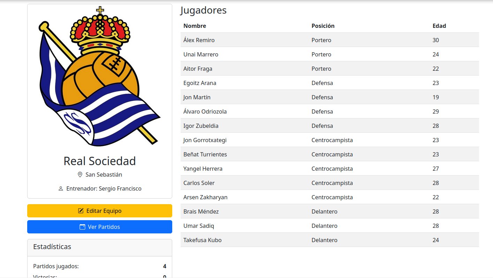
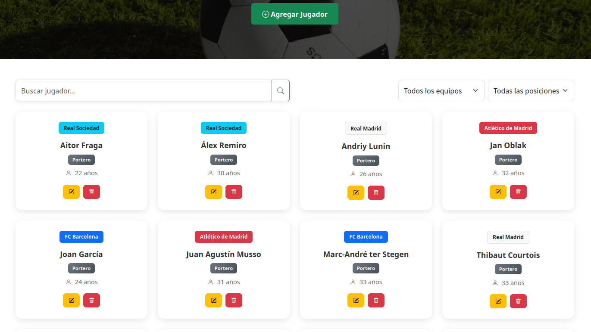
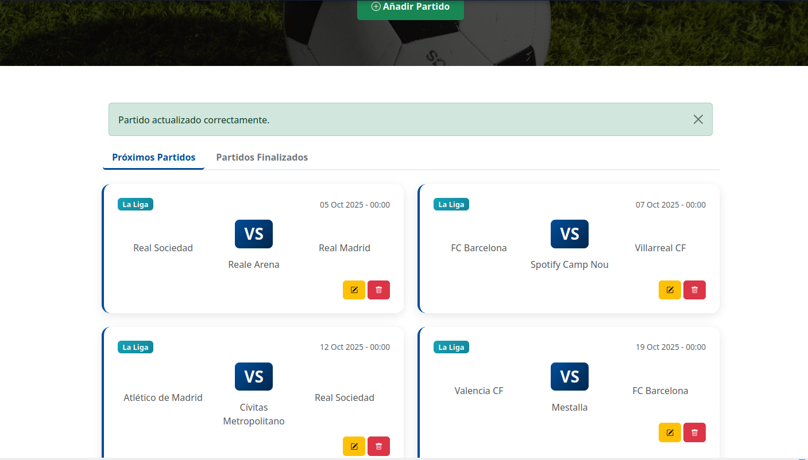

# FootballDesk

[Read in English](README.md)

> Proyecto Personal:

FootballDesk es una aplicación web que te permite gestionar tus equipos de fútbol, jugadores y partidos de manera sencilla gracias a un sistema CRUD intuitivo.  

## Funcionalidades

- Gestionar equipos de fútbol: crear, editar y eliminar.
- Registrar y organizar jugadores.
- Programar partidos y llevar un seguimiento de los resultados.
- Interfaz responsiva.

## Tecnologías

### Backend
- PHP
- MySQL
### Frontend
- Bootstrap
- HTML
- CSS
- JavaScript

## Instalación

1. Clona este repositorio

```bash
git clone https://github.com/iOteizaa/FootballDesk.git
```
2. Importa las bases de datos (/sql):
- Ejecuta `sql/script.sql` para crear las tablas.
- Ejecuta `sql/data.sql` para insertar datos de ejemplo (opcional).

3. Configura la conexión a la base de datos (/config/database.php).
    
4. Inicia un servidor local (XAMPP) y accede al proyecto.

## Uso

1. Crea una cuenta de administrador
Antes de poder añadir, editar o eliminar equipos, jugadores o partidos, primero debes crear una cuenta de administrador.

2. Accede a la aplicación
Abre tu navegador y accede a `http://localhost/FootballDesk`.

3. Gestiona el contenido
Una vez que hayas iniciado sesión como administrador, podrás administrar equipos, jugadores y partidos fácilmente desde la interfaz.

## Demo

### Detalles del equipo
[](demo/teams.PNG)  
Esta captura muestra la página de detalles de un equipo, incluyendo la información del equipo, los jugadores y la opción para editar.

### Jugadores
[](demo/players.PNG)  
Captura de la página de jugadores, muestra los jugadores registrados y las opciones para añadir, editar o eliminar.

### Partidos
[](demo/matches.PNG)
Captura de la página de partidos, donde se pueden ver los partidos sin jugar y los resultados de los finalizados.

