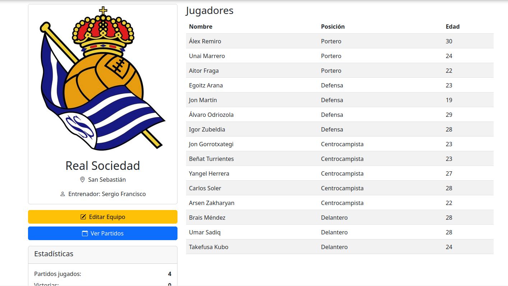
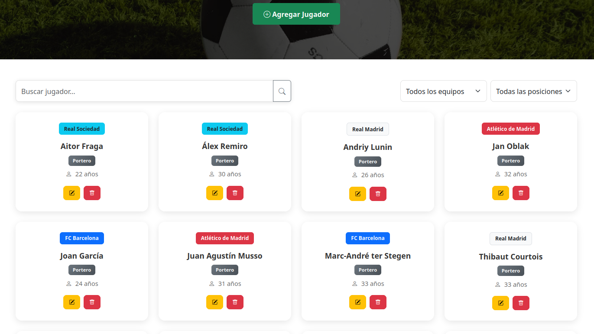
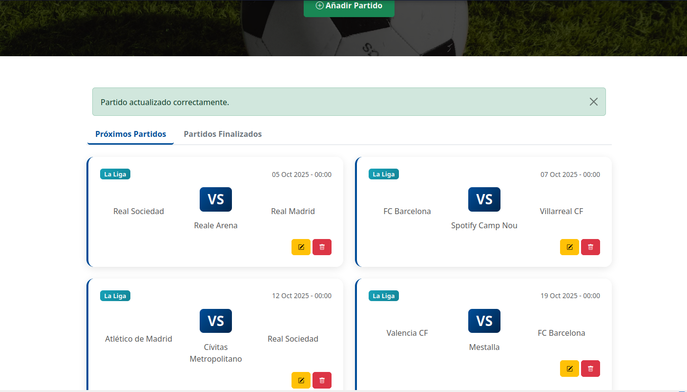

# FootballDesk

[Leer en español](README.es.md)

> Personal project:

FootballDesk is a web app for managing football teams, players, and matches through an intuitive CRUD system.  

## Features

- Manage football teams (Create, edit and delete).
- Register and organize players.
- Schedule and track matches.
- Responsive design with Bootstrap.

## Tech Stack

### Backend
- PHP
- MySQL
### Frontend
- Bootstrap
- HTML
- CSS
- JavaScript

## Installation

1. Clone this repository:

```bash
git clone https://github.com/iOteizaa/FootballDesk.git
```
2. Import the database (/sql):
- Run `sql/script.sql` to create tables.
- Run `sql/data.sql` to insert sample data (optional).

3. Configure the database connection (/config/database.php).
    
4. Start a local server (XAMPP) and access the project.

## Usage

1. Create an administrator account
Before you can add, edit or delete teams, players or matches you need to create an administrator account.

2. Access the application
Open your browser and go to `http://localhost/FootballDesk`.

3. Manage content
Once logged in as an admin, you can manage teams, players and matches through the interface.

## Demo

### Team Details
[](demo/teams.PNG)  
Screenshot of the team details page showing the team information, players, and option to edit.

### Players
[](demo/players.PNG)  
Screenshot of the players page showing registered players and options to add/edit/delete.

### Matches
[](demo/matches.PNG)
Screenshot of the matches page with scheduled games and results.

